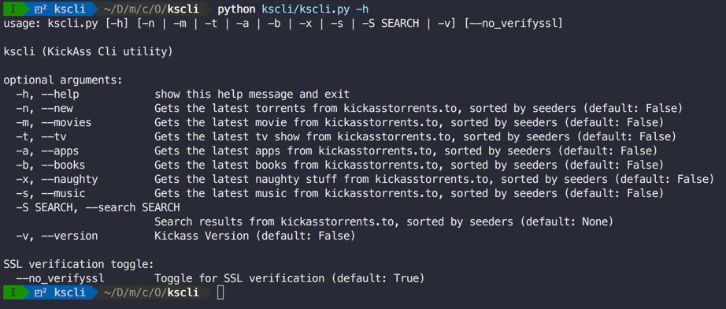
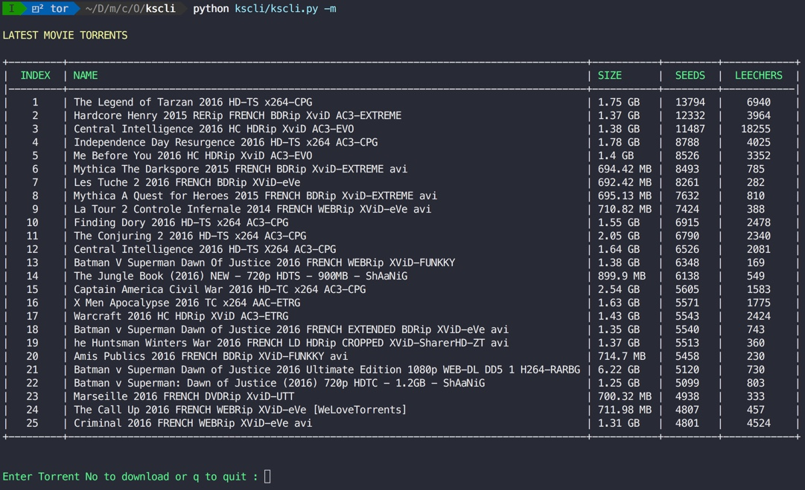

# kscli
<p align="left">
    <a href="https://github.com/kodelint/kscli/blob/master/LICENSE">
        
    </a>
    <a href="https://github.com/kodelint/kscli/blob/master/CONTRIBUTING.md">
        
    </a>
</p>

Command line utility for [KickAss Torrents](http://kickasstorrents.to)

`kscli` is a command line utility for [kickasstorrents](http://kickasstorrents.to).

#### Installation

```
pip install -r requirements.txt
```
_**Note: I do have the `setup.py` but the functionality is not been implemented yet.**_

```
$ python kscli/kscli.py --help
usage: kscli.py [-h] [-n | -m | -t | -a | -b | -x | -s | -S SEARCH | -v] [--no_verifyssl]

kscli (KickAss Cli utility)

optional arguments:
  -h, --help            show this help message and exit
  -n, --new             Gets the latest torrents from kickasstorrents.to, sorted by seeders (default: False)
  -m, --movies          Gets the latest movie from kickasstorrents.to, sorted by seeders (default: False)
  -t, --tv              Gets the latest tv show from kickasstorrents.to, sorted by seeders (default: False)
  -a, --apps            Gets the latest apps from kickasstorrents.to, sorted by seeders (default: False)
  -b, --books           Gets the latest books from kickasstorrents.to, sorted by seeders (default: False)
  -x, --naughty         Gets the latest naughty stuff from kickasstorrents.to, sorted by seeders (default: False)
  -s, --music           Gets the latest music from kickasstorrents.to, sorted by seeders (default: False)
  -S SEARCH, --search SEARCH
                        Gets the latest music from kickasstorrents.to, sorted by seeders (default: None)
  -v, --version         Kickass Version (default: False)

SSL verification toggle:
  --no_verifyssl        Toggle for SSL verification (default: True)
```

#### Screenshots:





#### Dependencies:

`kscli` depends on [webtorrent](https://github.com/feross/webtorrent.git) for downloading the torrents. you can install [webtorrent](https://github.com/feross/webtorrent.git) using `npm` i.e.

```
npm install webtorrent
```

`kscli` works in 2 phases:
   1. List the latest:
       - `-m` or `--movies` 25 movies with highest seeder's count
       - `-t` or `--tv` 25 tv shows with highest seeder's count
       - `-b` or `--books` 25 books with highest seeder's count
       - `-s` or `--songs` 25 songs with highest seeder's count
       - `-a` or `--apps` 25 apps with highest seeder's count
       - `-x` or `--naughty` 25 naughty movies with highest seeder's count
       - `-n` or `--new` 25 new trending torrents  


   2. Download the torrent using [webtorrent](https://github.com/feross/webtorrent.git)


* TODO
 - Remove the hard limit of **25** records
 - Dynamically choose kickass torrent site based on availability.


 #### Credits
 * [Satyajit Roy](kodelint@gmail.com)

 #### Thanks

 Special **Thanks** to [Aly Akhtar](https://github.com/alyakhtar) for authoring [Katastrophe](https://github.com/alyakhtar/Katastrophe.git), which was the real inspiration behind [kscli](https://github.com/kodelint/kscli.git)
